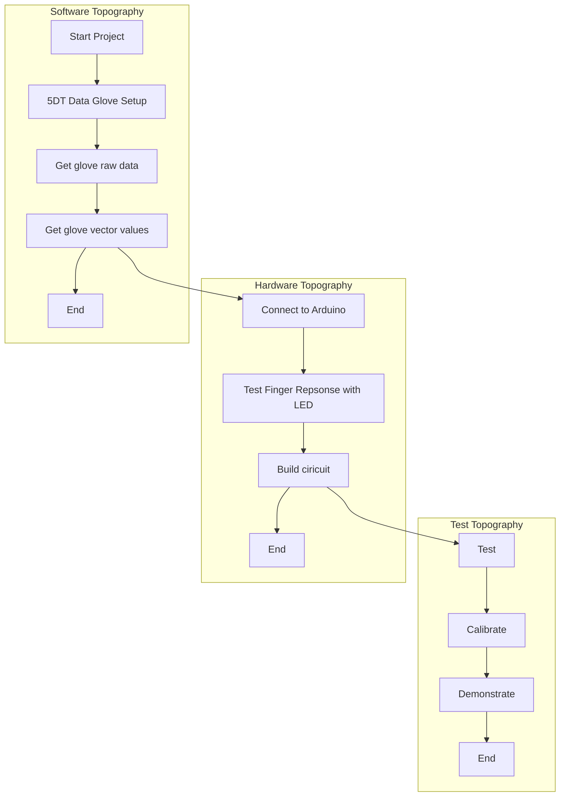

# Arduino-based Electrotactile Simulation System for Virtual Sensory Contact

The project has been tweaked a little bit from it's orginal assignment. Elaborating on the project title, a glove will be worn by a user, and mapping of the finger movements will determine whether contact with a virtual object has been made.
Upon contact, the user will experience electrotactile stimulation on their fingertips, sufficient enough to give the impression of touch.

## Plan



## Getting Started (Software Based)
Should you want to replicate this project you will need the following software prerequisites.

| Software | Version | Link |
| ---      |  ------  |---------:|
| Python  | 2.7   | [#](https://www.python.org/ftp/python/2.7/python-2.7.amd64.msi)   |
| Motionbuilder | 2018 | cell 6 is much lze. |
| cell 7   |          | cell <br> 9 |

### Prerequisites and installation links
* [Python 2.7](https://www.python.org/ftp/python/2.7/python-2.7.amd64.msi)
* [Motionbuilder 2018](https://www.autodesk.com/education/free-software/motionbuilder)
* [Arduino IDE](https://www.arduino.cc/download_handler.php?f=https://www.microsoft.com/store/apps/9nblggh4rsd8?ocid=badge)
* [PyCharm](https://www.jetbrains.com/pycharm/download/download-thanks.html?platform=windows&code=PCC)
* [Multisim](https://www.ni.com/en-gb/support/downloads/software-products/download.multisim.html#312060)
* 5DT Ultra Data Glove

#### Install libraries and run program

```
pip install pyserial
```

### Running Tests
The 5DT Data Glove comes with a 'GloveManager' application, this can be used to test each finger connectivity.

## Getting Started (Hardware Based)

### Pre-requisites

* Components
*   LEDs, Resistors, Wires, Capacitors
* PBC
* Arduino UNO Board
* MAX232 Driver/Reciever
 
### Component Testing

### PCB Board design
Board design will be designed and simulated in Multisim prior to building.

### System Building

## Authors
Provide your names here
* Javan Willock - Project Developer

## References
* [Gitlab Markdown Guide](https://docs.gitlab.com/ee/user/markdown.html)
* [Example 1](https://github.com/erasmus-without-paper/ewp-specs-sec-intro/tree/v2.0.2)
* [Example 2](https://github.com/erasmus-without-paper/ewp-specs-architecture/tree/v1.10.0)
