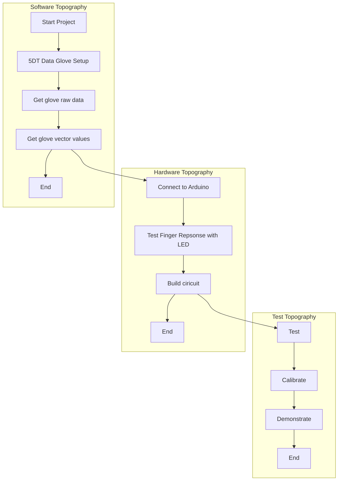

# Arduino-based Electrotactile Simulation System for Virtual Sensory Contact

The project has been tweaked a little bit from it's orginal assignment. Elaborating on the project title, a glove will be worn by a user, 
and mapping of the finger movements will determine whether contact with a virtual object has been made.
Upon contact, the user will experience electrotactile stimulation on their fingertips, sufficient enough to give the impression of touch.

## What is Electrotactile Stimulation (ETS)?
Electrotactile feedback stimulation development is the subject of many research projects, with ideas for use from medicine to the industry and then every day consumers. 
The main idea being to communicate non-tactile information via electrical stimulation of the sense of touch to the user. 

Successful inplementation of electrotactile feedback (ETF) could result in a better standard of living and/or increased experiences and safety in a variety of environments. 
Individuals without the ability to process information in a conventional way, i.e through their eyes, may find that they can still experience the world via ETS.
And in situations where an individual is teleoperating a system where sensation may be of benefit. An elaborate example of this being an astronaut out on a moonwalk.

There are also applications in prosthetics and virtual reality (the underlying basis for this project). 


## Plan

Below is a rough guidline of how I will be going about the creation of a the prototype. 



## [Getting Started (Software Based)](https://cseegit.essex.ac.uk/ce301_2019/ce301_willock_j/blob/master/Technical%20Documentation/Getting%20Started%20(Software).md)
Should you want to replicate this project you will need the following software prerequisites.
### Prerequisites and Installation Links
| Software      | Version  | Download Link                                                                                                   |
| ---           |  ------  |---------:                                                                                                       |
| Python        |2.7       | [#](https://www.python.org/ftp/python/2.7/python-2.7.amd64.msi)                                                 |
| Motionbuilder |2018      | [#](https://www.arduino.cc/download_handler.php?f=https://www.microsoft.com/store/apps/9nblggh4rsd8?ocid=badge) |
| Arduino IDE   |1.8.10    | [#](https://www.arduino.cc/download_handler.php?f=https://www.microsoft.com/store/apps/9nblggh4rsd8?ocid=badge) |
| PyCharm       |2019.2.4  | [#](https://www.jetbrains.com/pycharm/download/download-thanks.html?platform=windows&code=PCC)                  |
| Multisim      |14.1      | [#](https://www.ni.com/en-gb/support/downloads/software-products/download.multisim.html#312060)                 |


#### Install libraries
To install pip
```
curl https://bootstrap.pypa.io/get-pip.py -o get-pip.py
python get-pip.py
```

Then install serial lib
```
pip install pyserial

```

## Getting Started (Hardware Based)

### Pre-requisites
| Topic           | Description  | 
| ---             |  ------  |
| 5DT Data Glove  | Ultra    |   
| LEDs            |          |
| Resitors        |    10k   |
| Capacitors      |    1uF   |
| Wires           |          |
| PCB             |          |
| Arduino Board   |  UNO     |
| Driver/Reciever |  MAX232  |
| Electrodes      |          |

### Component Testing

### PCB Board design
Board design will be designed and simulated in Multisim prior to building.

### System Building

## Authors
Provide your names here
* Javan Willock - Project Developer

## References
* [Gitlab Markdown Guide](https://docs.gitlab.com/ee/user/markdown.html)
* [Example 1](https://github.com/erasmus-without-paper/ewp-specs-sec-intro/tree/v2.0.2)
* [Example 2](https://github.com/erasmus-without-paper/ewp-specs-architecture/tree/v1.10.0)
